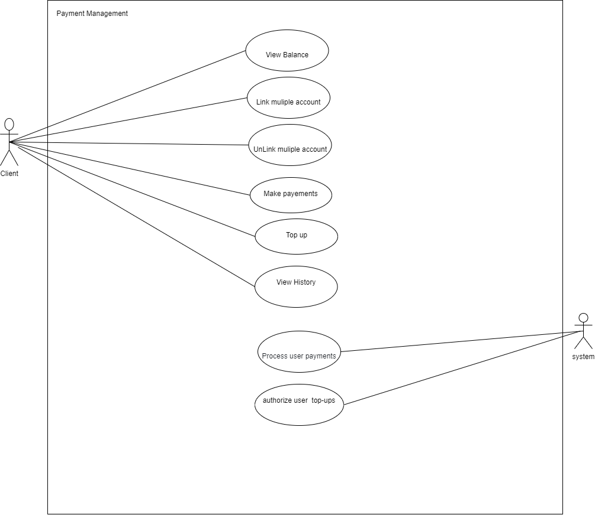
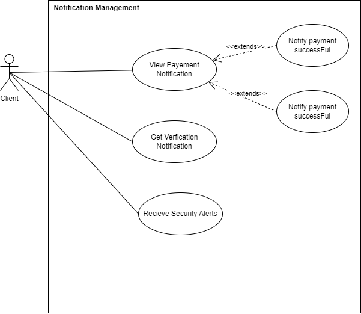
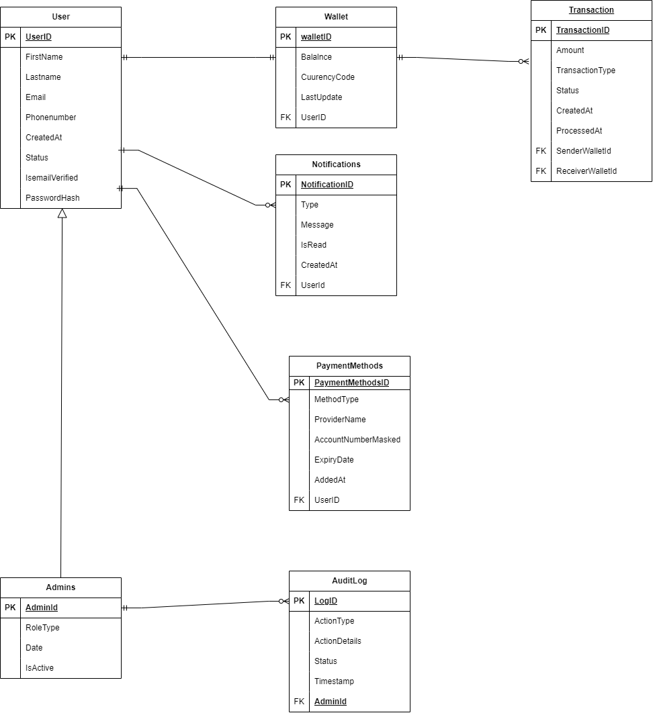

---
# Functional Requirements

## Users should be able to:
- Register using email verification or OTP.
- Log in and log out securely from web or mobile.
- View and update their profile and account settings.
- Reset or change their password securely.

## Administrators should be able to:
- View and manage user profiles.
- Deactivate or flag user accounts for review.
- Assist users with account recovery.

## End Users should be able to:
- View their current wallet balance in real-time.
- Link and unlink multiple payment methods (e.g., credit cards, bank accounts).
- Make real-time payments to merchants or other users.
- Top up their wallet using external funding sources.
- View a full history of transactions, including dates, amounts, and status.

## External Payment Gateway/Bank Systems should be able to:
- Process and authorize user payments and top-ups.
- Send confirmation of successful or failed transactions.

## End Users should be able to:
- Receive real-time push or in-app notifications about payment success or failure.
- Get SMS or email alerts for verification, login attempts, or critical account actions.

## Administrators should be able to:
- Monitor all user transactions in the system.
- Access detailed user profiles and account activity.
- Flag suspicious transactions or users for investigation.
- Take administrative actions such as freezing accounts or rolling back transactions.
- Resolve user disputes and complaints regarding transactions.

## Administrators should be able to:
- Generate daily, weekly, and monthly transaction reports.
- View usage statistics such as top users or most common transaction types.
- Access audit logs of administrative actions taken.
- Track system performance and user growth metrics.

## End Users should be able to:
- Authenticate using secure, encrypted methods.
- Access their account only with proper credentials or 2FA.
- Receive alerts for login from new devices or suspicious activity.

## Administrators should be able to:
- Define and manage roles and access levels (e.g., admin vs. support staff).
- Ensure system compliance with PCI DSS and GDPR.
- Monitor system logs for anomalies or unauthorized access attempts.

---
# Use Case Diagrams

Below are the key use cases represented visually.

 

---
# SmartPay Database Design Diagrams

